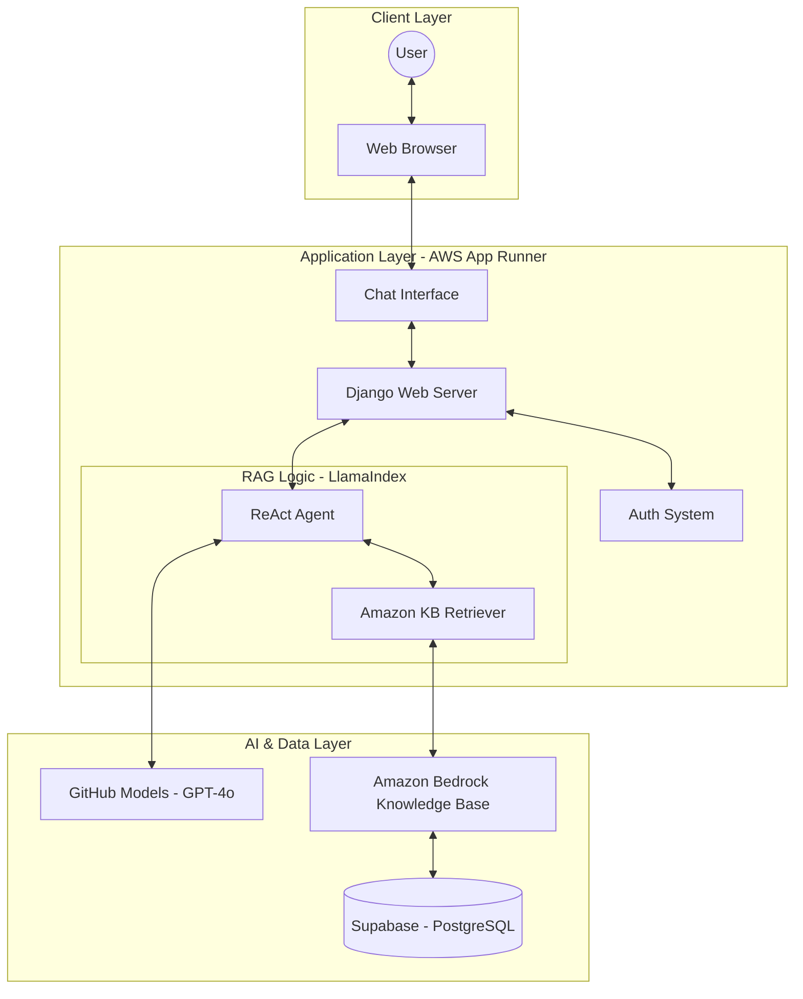
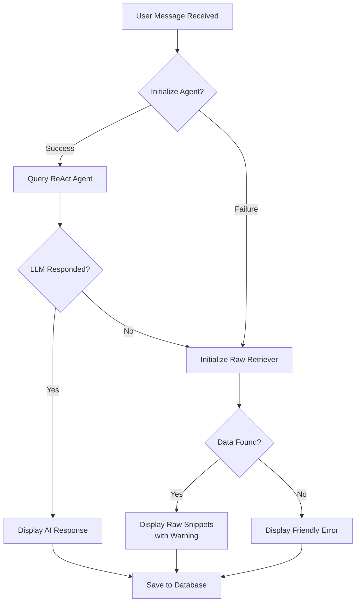
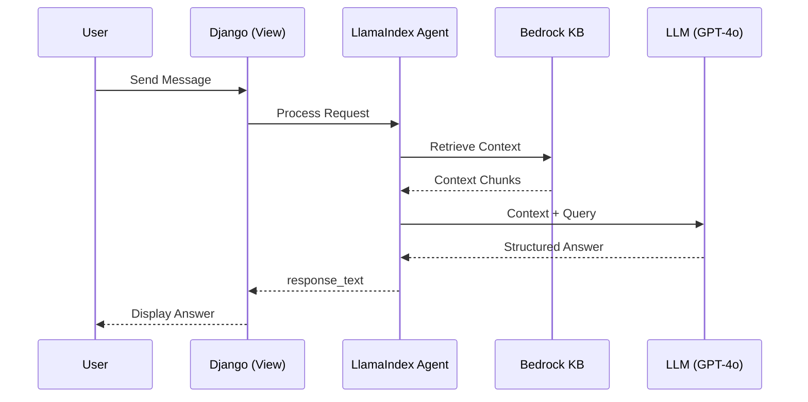

# LPU RAG - University Management System Assistant  (by Vicky & Jashanprit)

A production-ready Generative AI chatbot built with **Django**, **LlamaIndex**, and **AWS Bedrock**. This system serves as an intelligent assistant for Lovely Professional University (LPU), providing accurate information about courses, rules, and campus life using Retrieval-Augmented Generation (RAG).

## 🏗 system Architecture



## 🔄 RAG Workflow

This diagram illustrates the decision logic behind every response, including the robust fallback mechanism.



## 📡 Sequence Diagram



## 🛠 Features
- **Intelligent RAG**: Uses LlamaIndex ReAct agent for multi-step reasoning.
- **Robust Fallback**: Automatically switches to raw vector retrieval if the LLM or API is unavailable.
- **AWS Integrated**: Leverages Amazon Bedrock Knowledge Bases for enterprise-grade retrieval.
- **Data Persistence**: Managed by **Supabase (PostgreSQL)** for secure and scalable history management.
- **Enterprise Grade**: Deployed via Docker on **AWS App Runner**.
- **Secure**: Integrated with Django's authentication and CSRF protection.

## 🚀 Getting Started

### Prerequisites
- Python 3.12+
- Docker (optional)
- AWS Credentials (with Bedrock access)
- GitHub Token (for LLM inference)

### Installation
1. Clone the repo:
   ```bash
   git clone https://github.com/MAVIcVICKY/LPU_RAG.git
   cd LPU_RAG
   ```
2. Setup environment variables:
   Create a `.env` file based on `.env.example`.
3. Install dependencies:
   ```bash
   pip install -r requirements.txt
   ```
4. Run migrations:
   ```bash
   python manage.py migrate
   ```
5. Start server:
   ```bash
   python manage.py runserver
   ```
