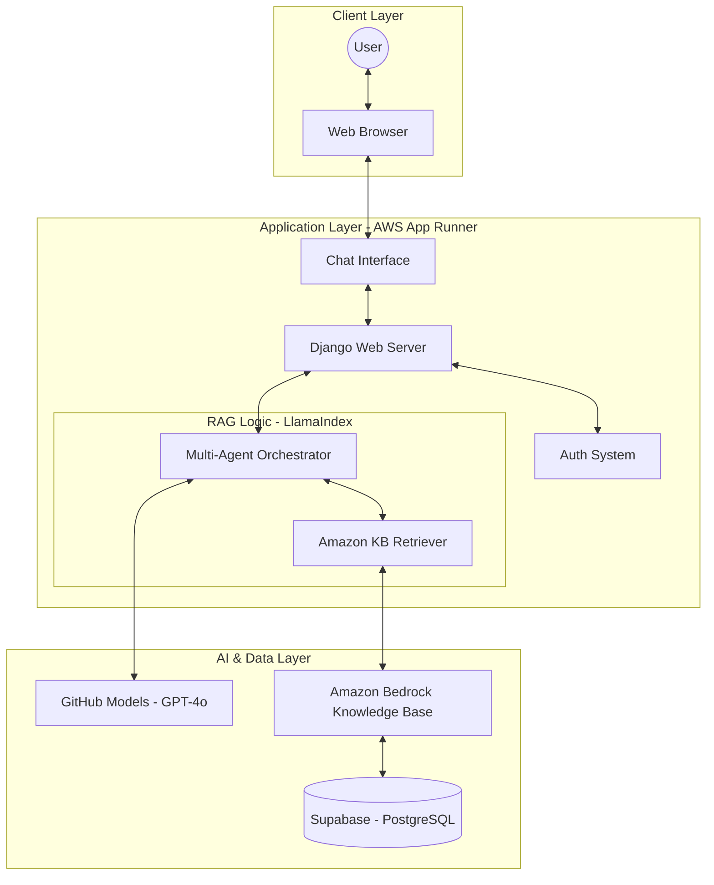
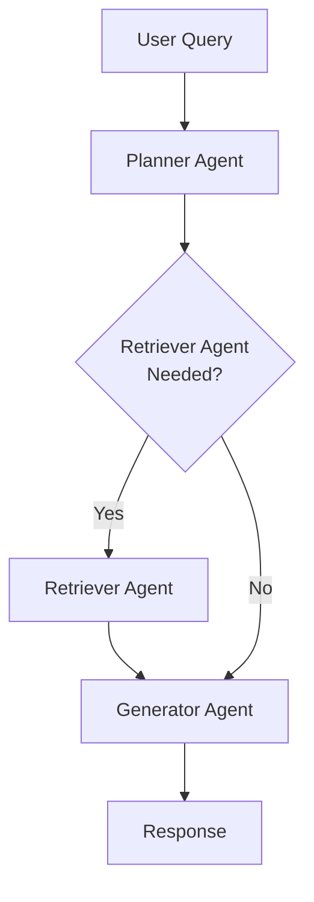
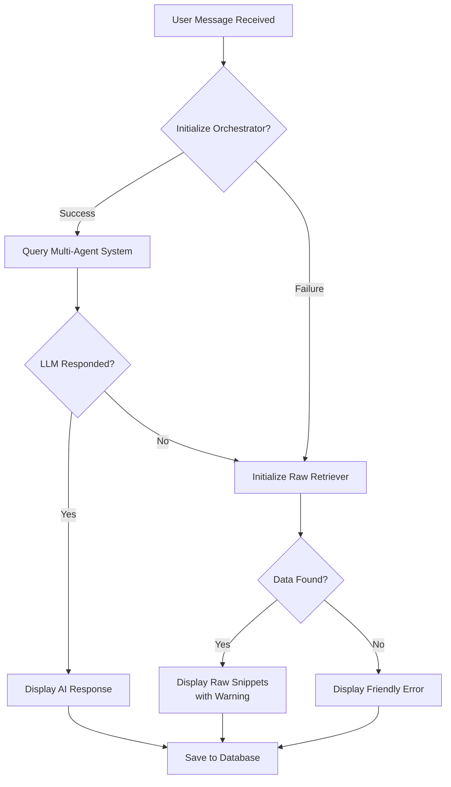
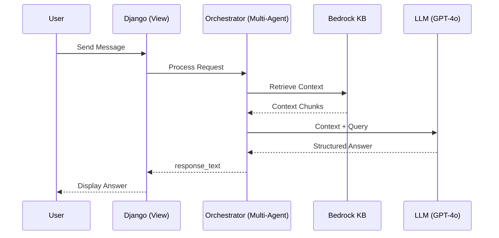

# 🦉 LPU UMS AI Assistant (RAG Chatbot)

An intelligent, production-grade Retrieval-Augmented Generation (RAG) chatbot designed for the **University Management System (UMS)**. This assistant helps students and staff navigate university life by providing instant, accurate answers about admissions, fees, courses, placements, and more.

---

## ✨ Key Features
- **Intelligent RAG Pipeline**: Leverages **LlamaIndex** with **Amazon Bedrock** for precise context-aware answering.
- **Premium UI/UX**: A modern, responsive interface built with vanilla CSS, featuring glassmorphism and smooth micro-animations.
- **Multi-Model Support**: Integrated with **Claude 3 (Amazon Bedrock)** and **GPT-4o (GitHub Models)** for high-quality inference.
- **Enterprise Security**: Production-ready security settings including SSL enforcement, CSRF protection, and secure session management.
- **Containerized Deployment**: Fully dockerized and optimized for **AWS App Runner**.

---

## 📸 Demo Screenshots

<div align="center">
  
  &nbsp;
  
</div>

---


## 🏗 System Architecture



## 🤖 Agentic Workflow

This diagram represents the high-level orchestration of our AI agents within the assistant:



### Agency Components:
- **Planner Agent**: Analyzes the intent of the user query to decide if it requires factual retrieval from university documents (`RETRIEVE`), general conversation (`DIRECT`), or should be rejected as out-of-context (`REJECT`).
- **Retriever Agent**: Interfaces with the **Amazon Bedrock Knowledge Base** to fetch high-relevance chunks of documentation.
- **Generator Agent**: Synthesizes the final response by combining the user's intent, the retrieved context, and the conversation history into a clear, professional answer.
- **Orchestrator**: Manages the state and transition between agents, ensuring robust fallback logic if any single component fails.

## 🔄 RAG Workflow

This diagram illustrates the decision logic behind every response, including the robust fallback mechanism.



## 📡 Sequence Diagram



---

## 🛠️ Tech Stack

### Frontend
- **HTML5/CSS3**: Modern, mobile-first design system.
- **JavaScript (ES6+)**: Custom chat logic and UI interactions.
- **Marked.js**: High-performance Markdown rendering for bot responses.

### Backend
- **Django**: Robust Python web framework.
- **Gunicorn**: Production WSGI HTTP server.
- **WhiteNoise**: Efficient static file serving for containerized environments.

### AI & Data
- **RAG Engine**: LlamaIndex (Multi-Agent Orchestrator).
- **LLMs**: Claude 3 (AWS Bedrock), GPT-4o (GitHub Models).
- **Vector Database**: Amazon Bedrock Knowledge Bases.
- **Database**: 
  - **Local**: SQLite
  - **Production**: Supabase (PostgreSQL)

---

## 🚀 Local Setup

### 1. Clone the Repository
```bash
git clone https://github.com/MAVIcVICKY/LPU_RAG.git
cd LPU_RAG
```

### 2. Configure Environment Variables
Create a `.env` file in the root directory and add the following (see `.env.example` for reference):
```env
DJANGO_SECRET_KEY=your-secret-key
DJANGO_DEBUG=True
DB_NAME=your-db-name
DB_USER=your-db-user
DB_PASSWORD=your-db-password
DB_HOST=your-db-host
DB_PORT=5432

# AWS Credentials
AWS_ACCESS_KEY_ID=your-access-key
AWS_SECRET_ACCESS_KEY=your-secret-key
AWS_REGION=ap-south-1

# Knowledge Base
AWS_KB_ID=your-knowledge-base-id
```

### 3. Install Dependencies
```bash
pip install -r requirements.txt
```

### 4. Run Migrations & Start Server
```bash
python manage.py migrate
python manage.py runserver
```

---

## 🐳 Deployment (Docker & AWS)

> [!IMPORTANT]
> All commands below must be executed from the `LPU_RAG` directory (where the `Dockerfile` is located).

### Push to Amazon ECR
Retrieve an authentication token and authenticate your Docker client to your registry:
```powershell
(Get-ECRLoginCommand).Password | docker login --username AWS --password-stdin 804594767592.dkr.ecr.ap-south-1.amazonaws.com
```

Build, tag, and push your image:
```bash
docker build -t rag-bot .
docker tag rag-bot:latest 804594767592.dkr.ecr.ap-south-1.amazonaws.com/rag-bot:latest
docker push 804594767592.dkr.ecr.ap-south-1.amazonaws.com/rag-bot:latest
```

---

## 🎨 Design Philosophy
The UI follows a **clean, modern aesthetic** inspired by premium SaaS applications:
- **Responsive Layout**: Designed to look like a native application on mobile while providing a full-featured dashboard on desktop.
- **Visual Feedback**: Subtle hover states, smooth scroll behaviors, and slide-up animations for messages.
- **Accessibility**: Clear contrast ratios and legible typography using the **Roboto** font family.

---

## 📄 License
© 2026 University Management System AI Portal. All Rights Reserved.
